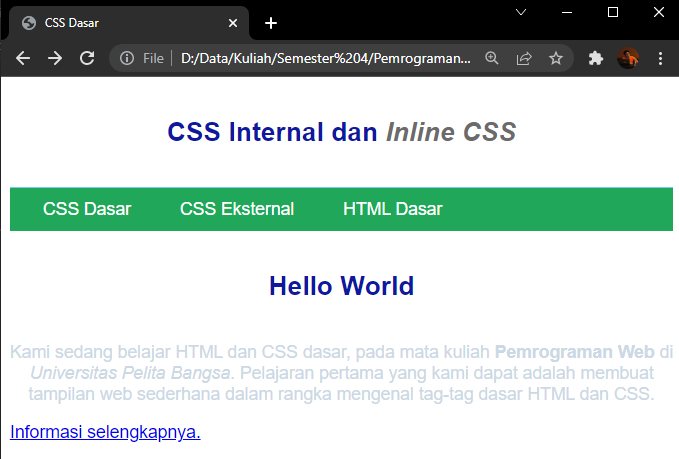

# Lab2Web

## Tugas Praktikum 2 : CSS Dasar

Nama    : Faza Ardan Kusuma <br>
NIM     : 312010001<br>
Kelas   : TI 20 B1

<hr>

Untuk praktikum kali ini tag dibuat dengan nama <b>Lab2_css_dasar.html</b><br>

## 1. Membuat Dokumen HTML

Setelah membuat tag, masukan syntax berikut : <br>
```
<!DOCTYPE html> 
<html lang="en"> 
<head> 
    <meta charset="UTF-8"> 
    <meta name="viewport" content="width=device-width, initial-scale=1.0"> 
<title>CSS Dasar</title>
</head> 
<body> 
    <header> 
        <h1>CSS Internal dan <i>Inline CSS</i></h1> 
    </header> 
    <nav> 
        <a href="lab2_css_dasar.html">CSS Dasar</a> 
        <a href="lab2_css_eksternal.html">CSS Eksternal</a> 
        <a href="lab1_tag_dasar.html">HTML Dasar</a> 
    </nav> 
    <!-- CSS ID Selector --> 
    <div id="intro"> 
        <h1>Hello World</h1> 
        <p>Kami sedang belajar HTML dan CSS dasar, pada mata kuliah <b>Pemrograman Web</b> di <i>Universitas Pelita Bangsa</i>. Pelajaran pertama yang kami dapat adalah membuat tampilan web sederhana dalam rangka mengenal tag-tag dasar HTML dan CSS.</p> 
    <!-- CSS Class Selector --> 
    <a class="button btn-primary" href="#intro">Informasi selengkapnya.</a> 
    </div> 
</body> 
</html> 
```

Tampilan dari syntax tersebut :<br>
<br>

## 2. Mendeklarasikan CSS Internal

Kemudian kita tambahkan deklarasi CSS internal pada bagian head dokumen. Saya rubah font dan warnanya dengan menambahkan syntax berikut : <br>
```
 <style>
     body{
         font-family: 'Open Sans', sans-serif;
     }
     header{
         min-height: 80px;
         border-bottom: 1px solid #77CCEF;
     }
     h1 {
         font-size: 24px;
         color: #0F189F;
         text-align: center;
         padding: 20px 10px;
     }
     h1 i {
         color: #6d6a6b;
     }
 </style>
 ```

 Setelah ditambahkan, mMaka syntaxnya menjadi :<br>
```
<!DOCTYPE html> 
<html lang="en"> 
<head> 
    <meta charset="UTF-8"> 
    <meta name="viewport" content="width=device-width, initial-scale=1.0"> 
<title>CSS Dasar</title>
 <style>
     body{
         font-family: 'Open Sans', sans-serif;
     }
     header{
         min-height: 80px;
         border-bottom: 1px solid #77CCEF;
     }
     h1 {
         font-size: 24px;
         color: #0F189F;
         text-align: center;
         padding: 20px 10px;
     }
     h1 i {
         color: #6d6a6b;
     }
 </style>
</head> 
<body> 
    <header> 
        <h1>CSS Internal dan <i>Inline CSS</i></h1> 
    </header> 
    <nav> 
        <a href="lab2_css_dasar.html">CSS Dasar</a> 
        <a href="lab2_css_eksternal.html">CSS Eksternal</a> 
        <a href="lab1_tag_dasar.html">HTML Dasar</a> 
    </nav> 
    <!-- CSS ID Selector --> 
    <div id="intro"> 
        <h1>Hello World</h1> 
        <p>Kami sedang belajar HTML dan CSS dasar, pada mata kuliah <b>Pemrograman Web</b> di <i>Universitas Pelita Bangsa</i>. Pelajaran pertama yang kami dapat adalah membuat tampilan web sederhana dalam rangka mengenal tag-tag dasar HTML dan CSS.</p> 
    <!-- CSS Class Selector --> 
    <a class="button btn-primary" href="#intro">Informasi selengkapnya.</a> 
    </div> 
</body> 
</html> 
```

Tampilan output : <br>
<br>

## 3. Menambahkan Inline CSS

Kemudian saya akan menambahkan Inline CSS, yaitu paragraf saya jadikan center dan warnanya menjadi abu - abu dengam menambahkan syntax berikut kedalam tag \<p> : <br>
```
style="text-align: center; color: #ccd8e4;"
```
Setelah ditambahkan, syntax lengkapnya menjadi seperti berikut :<br>
```<!DOCTYPE html> 
<html lang="en"> 
<head> 
    <meta charset="UTF-8"> 
    <meta name="viewport" content="width=device-width, initial-scale=1.0"> 
<title>CSS Dasar</title>
 <style>
     body{
         font-family: 'Open Sans', sans-serif;
     }
     header{
         min-height: 80px;
         border-bottom: 1px solid #77CCEF;
     }
     h1 {
         font-size: 24px;
         color: #0F189F;
         text-align: center;
         padding: 20px 10px;
     }
     h1 i {
         color: #6d6a6b;
     }
 </style>
</head> 
<body> 
    <header> 
        <h1>CSS Internal dan <i>Inline CSS</i></h1> 
    </header> 
    <nav> 
        <a href="lab2_css_dasar.html">CSS Dasar</a> 
        <a href="lab2_css_eksternal.html">CSS Eksternal</a> 
        <a href="lab1_tag_dasar.html">HTML Dasar</a> 
    </nav> 
    <!-- CSS ID Selector --> 
    <div id="intro"> 
        <h1>Hello World</h1> 
        <p style="text-align: center; color: #ccd8e4;">Kami sedang belajar HTML dan CSS dasar, pada mata kuliah <b>Pemrograman Web</b> di <i>Universitas Pelita Bangsa</i>. Pelajaran pertama yang kami dapat adalah membuat tampilan web sederhana dalam rangka mengenal tag-tag dasar HTML dan CSS.</p> 
    <!-- CSS Class Selector --> 
    <a class="button btn-primary" href="#intro">Informasi selengkapnya.</a> 
    </div> 
</body> 
</html> 
```

Tampilannya menjadi : <br>
<br>

## 4. Membuat CSS External

Untuk membuat external CSS, maka saya akan membuat file baru dengan nama <b>style_external.css</b>, dengan syntax :<br>
```
nav { 
    background: #20A759; 
    color:#fff; 
    padding: 10px; 
} 
nav a { 
    color: #fff; 
    text-decoration: none; 
    padding:10px 20px; 
} 
nav .active, 
nav a:hover { 
    background: #0B6B3A; 
}
```
Setelah membuat external CSS, maka tambahkan tag /<link> pada /<head> untuk memanggil file CSS yang sudah dibuat tadi.<br>
```
<link rel="stylesheet" href="style_eksternal.css" type="text/css">
```

Kemudian, syntaxnya mendjadi berikut :<br>
```
<!DOCTYPE html> 
<html lang="en"> 
<head> 
<link rel="stylesheet" href="style_external.css" type="text/css"    >
    <meta charset="UTF-8"> 
    <meta name="viewport" content="width=device-width, initial-scale=1.0"> 
<title>CSS Dasar</title>
 <style>
     body{
         font-family: 'Open Sans', sans-serif;
     }
     header{
         min-height: 80px;
         border-bottom: 1px solid #77CCEF;
     }
     h1 {
         font-size: 24px;
         color: #0F189F;
         text-align: center;
         padding: 20px 10px;
     }
     h1 i {
         color: #6d6a6b;
     }
 </style>
</head> 
<body> 
    <header> 
        <h1>CSS Internal dan <i>Inline CSS</i></h1> 
    </header> 
    <nav> 
        <a href="lab2_css_dasar.html">CSS Dasar</a> 
        <a href="lab2_css_eksternal.html">CSS Eksternal</a> 
        <a href="lab1_tag_dasar.html">HTML Dasar</a> 
    </nav> 
    <!-- CSS ID Selector --> 
    <div id="intro"> 
        <h1>Hello World</h1> 
        <p style="text-align: center; color: #ccd8e4;">Kami sedang belajar HTML dan CSS dasar, pada mata kuliah <b>Pemrograman Web</b> di <i>Universitas Pelita Bangsa</i>. Pelajaran pertama yang kami dapat adalah membuat tampilan web sederhana dalam rangka mengenal tag-tag dasar HTML dan CSS.</p> 
    <!-- CSS Class Selector --> 
    <a class="button btn-primary" href="#intro">Informasi selengkapnya.</a> 
    </div> 
</body> 
</html> 
```

Tampilan :<br>
<br>

## 5. Menambahkan CSS Selector

Selanjutnya menambahkan CSS Selector menggunakan <b>ID dan Class Selector.</b> Pada file style_eksternal.css, tambahkan kode berikut.
```
/* ID Selector */ 
#intro { 
    background: #418fb1; 
    border: 1px solid #099249; 
    min-height: 100px; 
    padding: 10px; 
} 
#intro h1 { 
    text-align: left; 
    border: 0; 
    color: #fff; 
} 
/* Class Selector */ 
.button { 
    padding: 15px 20px; 
    background: #bebcbd; 
    color: #fff; 
    display: inline-block; 
    margin: 10px; 
    text-decoration: none; 
} 
.btn-primary { 
    background: #E42A42; 
```

Maka tampilan outputnya menjadi :<br>
<br>

<hr>

## Pertanyaan 
1. Lakukan eksperimen dengan mengubah dan menambah properti dan nilai pada kode CSS dengan mengacu pada CSS Cheat Sheet yang diberikan pada file terpisah dari modul ini.
2. Apa perbedaan pendeklarasian CSS elemen h1 {...} dengan #intro h1 {...}? berikan penjelasannya!
3.   Berikan penjelasan dan contohnya!
4. Pada sebuah elemen HTML terdapat ID dan Class, apabila masing-masing selector tersebut terdapat deklarasi CSS, maka deklarasi manakah yang akan ditampilkan pada browser? Berikan penjelasan dan contohnya! ( <p id="paragraf-1"class="text-paragraf"> )

## Jawaban

1. Disini saya merubah warna dari header sampai kebawah dan saya merubah paragraf menjadi rata kiri-kanan dan pada header saya jadikan center. Berikut tampilannya : <br>
<br>

2. Perbedaannya adalah CSS elemen h1 {...} berfungsi untuk merubah semua yang ada dalam elemen h1. Sedangkan h1 intro{...} atau h1 i{...} berfungsi merubah yang ada didalam tag intro tersebut. Seperti pada header CSS Interal dan Inline CSS yang dibuat tadi.<br>
<br>

3. Setelah saya coba bila ada deklarasi internal, CSS external dan inline CSS pada elemen yang sama, maka yang akan ditampilkan pada browser adalah dengan urutan berikut :<br>
    a. Inline CSS<br>
    b. CSS internal<br>
    c. CSS external<br>

Berikut syntax html yang saya buat :<br>
```
<!DOCTYPE html>
<html>
<head>
    <link rel="stylesheet" href="test_style.css" type="text/css">
    <style>
        h1 {
            color: greenyellow;
            text-align: center;
        } 
        p {
            color: darkblue;
            text-align: left;
        }
        </style>
</head>
<body>
 
    <h1 style="text-align: left; color: darkred;">Belajar HTML dan CSS</h1>
    <p style="text-align:center; color:aquamarine">Disini saya sedang belajar HTML Dan CSS</p>
 
</body>
</html>
```
Kemudian berikut syntax CSS externalnya :<br>
```
h1 {
    color: darkviolet;
    text-align: right;
}

p {
    color: black;
    text-align: right;
}
```

Dan tampilan dari syntax tersebut :<br>
<br>

Bila saya hilangkan Inline CSS, yang ditampilkan adalah CSS external terlebih dahulu. Berikut bila saya hapus <b><i>inline CSS</i></b>
```
<!DOCTYPE html>
<html>
<head>
    <link rel="stylesheet" href="test_style.css" type="text/css">
    <style>
        h1 {
            color: greenyellow;
            text-align: center;
        } 
        p {
            color: darkblue;
            text-align: left;
        }
        </style>
</head>
<body>  
 
    <h1>Belajar HTML dan CSS</h1>
    <p>Disini saya sedang belajar HTML Dan CSS</p>
 
</body>
</html>
```
Berikut tampilannya<br>
<br>

4. Dari percobaan yang saya lakukan, yang ditampilkan pada browser adalah ID selector.<br>

Berikut syntax yang saya buat : <br>
```
<!DOCTYPE html>
<html>
<body>
<style>
#paragraf-1 {color: aqua;}
.text-paragraf {color: red;}
</style>

<p id="paragraf-1" class="text-paragraf"> test dan coba</p>

</body>
</html>
```

Output : <br>
<br>